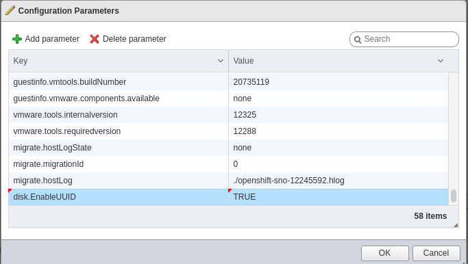
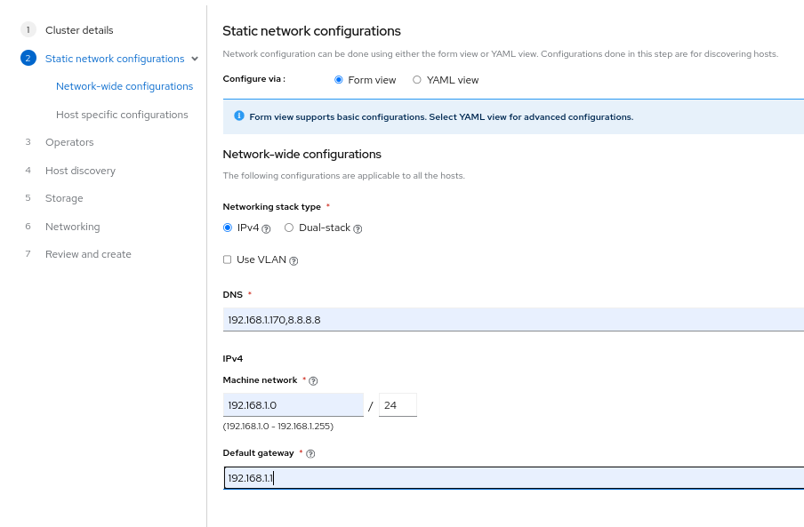
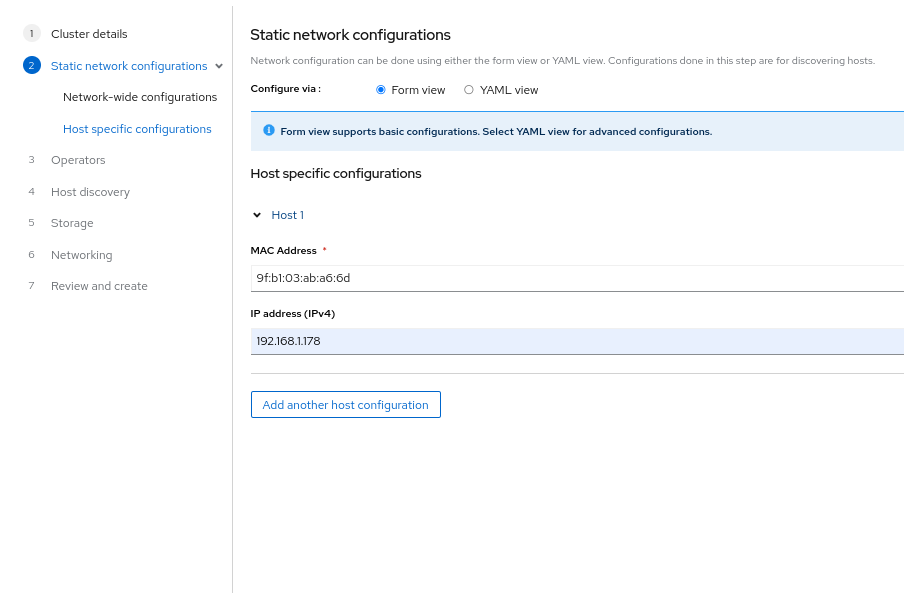

# Installing the Single Node Cluster by assisted installer.

Prerequistes

DNS should be configured. Following is an example zone file of DNS. In below zone file, Cluster domain name is `example.com`. Cluster name is - clustername. `192.168.1.170` is the IP adress of DNS server and `192.168.1.178` is the IP address of SNO - VM.

```bash
# ls -l /var/named/sno-forward 
-rw-r--r--. 1 root named 489 Jul 29 05:12 /var/named/sno-forward

cat /var/named/sno-forward

$TTL 86400
@   IN  SOA ns1.example.com. admin.example.com. (
            2023072601 ; Serial
            3600       ; Refresh
            1800       ; Retry
            604800     ; Expire
            86400 )    ; Negative Cache TTL

@       IN      NS      ns1.example.com.
ns1.example.com.                IN      A       192.168.1.170
smtp.example.com.               IN      A       192.168.1.178
;
helper.example.com.             IN      A       192.168.1.178
;
api.clustername.example.com.            IN      A       192.168.1.178
api-int.clustername.example.com.        IN      A       192.168.1.178
;
*.apps.clustername.example.com. IN      A       192.168.1.178
;
;EOF

```

Add the zone file into /etc/named.conf

```bash
zone "example.com" {
    type master;
    file "sno-forward";
};

```


1. Create a VM on Esxi with minimum 16 Ram, 100 GB HDD and 8 CPU cores.
2. Edit the VM settings, click on `VM Options` tab, and select `Advanced`.
3. Click on  `Edit Configuration` and then `Add Parameter`.
4. In the key column add `disk.EnableUUID` and in the value column add `TRUE` and then save it.



5. Login to the [Assisted Installer portal](https://console.redhat.com/openshift/assisted-installer/clusters) and create a new cluster.
6. Click on `Create Cluster` and provide the details like. `Cluster name`, `Base domain`, `Openshift Version`.
7. Tick on `Install single node openshift (SNO)` and choose Host's network configuration as `Static IP,brodges and bonds`
8. Under Static Network Configuration select `IPv4` and provide the `DNS` IPv4 `Machine Network` abd `Default Gateway` as shown in below image. Below are example values used during the configuration, replace these as per your environment.

8. On Host Specific Configuration page specify the `Mac Address` and `IP Address` of the host.

9. On Operators page, select operators you want to install. If not sure then leave it blank without ticking on any operators.

10. Under Host Discovery page, click on `Add Hosts`
11. Select `Full image file`.
12. Paste the SSH public key of the user which needs access to the SNO cluster by ssh(Optional).
13. Generate Discovery ISO
14. Boot the Esxi host by adding the downloaded ISO to the Datastore of Esxi.
15. Once Host is successfully booted from ISO, after few minutes host will appear under the `Host Discovery` tab.
16. Proceed further and fulfill the requirements if host is shown as insufficient.
